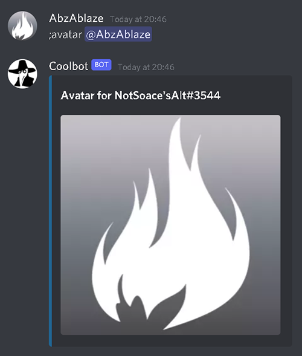

# Discord-Bot
A Discord bot designed with numerous utilities and features. Some of them include:

Avatar Command: Gives a downloadable link to user's avatar.

Colour Command: Assign the user a role colour. State colour using hex code.

Archive Command: Copies the references image to a specified channel for archive purposes. 

