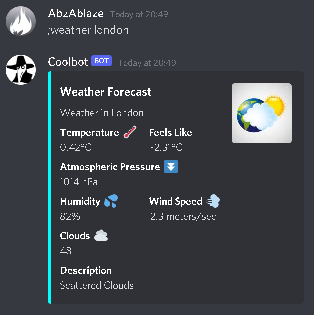

# Discord-Bot
A Discord bot designed with numerous utilities and features.

**Weather Command:** Uses OpenWeather API to fetch the weather data for an inputted city.

**Colour Command:** Assign the user a role colour. State colour using hex code.

**Chat Command:** An AI Chatbot features that lets you talk to the bot.

**Economy:** An extension that stores economy game data with PostgreSQL.

